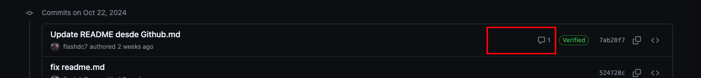

# Github
Cuando seleccionamos la opción de descarga, lo unico que hacemos es descargar los archivos, en cambio cuando clonamos el repositorio también obtenemos la historia de nuestro repositorio con nuestro archivo .git

>## Creación de una cuenta
>- Ingresamos a https://github.com/ e ingresamos a sign up
>- Ingresamos nuestro correo electrónico al cual tengamos acceso
>- Ingresamos una contraseña con la cual queremos ingresar
>- Y finalmente colocamos nuestro nombre de usuario que es el nombre con el cual nos van a ver en la plataforma. Este elemento no se puede cambiar por lo cual se recomienda usar uno que sea funcional y agradable al usuario

>## Conectar github a nuestro repositorio local
>- Presionamos el botón de crear repositorio e ingresamos un nombre válido para nuestro repositorio 
>- Podemos agregarle una descripción y dictar si sera público o privado y finalmente presionamos crear repositorio. ***Si seleccionamos que sea público las personas van a poder hacer un pull request y clonar nuestros archivos*** 
>- git remote add origin https://github.com/flashdc7/guia-basica-github.git
>- git branch -M main
>- git push -u origin main
>- Con estos comandos primero conectamos a nuestro repositorio, después renombramos la rama principal y finalmente subimos nuestro repositorio con un push. Una vez que ingresamos este comando nos va a pedir usuario y contraseña de github  
>- Si damos clic en algún commit podemos ver los cambios que se realizaron en ese commit
>
>  
>- *&nbsp;-u nos ayuda a qque la próxima vez que queramos hacer push, no necesitemos especificar la rama
>- ** origin es el nombre de nuestro repositorio
>- *** main es la rama que deseamos enviar

>## Revisar las fuentes remotas agregadas a nuestro repositorio
>- `git remote -v`

>## Subir tags de nuestro repositorio
>- `git push --tags`

>## Descargar repositorio
>- `git pull`
>- Para evitar problemas al momento de hacer un pull se recomienda configurar nuestro git local `git config --global pull.ff only`

>## Clonar repositorio
>- Desde github abrimos la opción de code y copiamos la url del repositorio
>- Ingresamos el siguiente código `git clone https://github.com/flashdc7/guia-basica-git.git` y presionamos ENTER
>    
>- Para evitar conflictos cuando hacemos un pull y hay un ajuste en una linea en particular en local y remoto podemos configurar nuestro repositorio local de la siguiente manera `git config pull.rebase true`
>- Igual podemos configurar para de manera global la opción de pull rebase `git config --global pull.rebase true`
>- En caso de que existiera un conflicto se realiza el ajuste en los archivos con conflicto y se realiza un commit nuevo
>- Y para finalizar corremos el siguiente comando `git rebase --continue`

>## Estrella ó Watch a un repositorio
>- Con STAR es como si dieramos like al repositorio ademas de que la plataforma en nuestro dashboard nos arroja cierta información cuando hay novedades
>- Con WATCH vemos los cambios, las novedades, y commits que ha tenido el repositorio

>## Buscar archivos
>- Para buscar archivos en github vamos a la opción superior, tecleamos algo relacionado al nombre del archivo
>    
>- Damos clic en el archivo que deseamos 
>- De manera local podemos buscar el archivo ayudandonos desde git copiando el path relativo
>    
>- Presionamos COMMAND + P en VS y pegamos el path que obtuvismos en git y presionamos ENTER para abrir el archivo 
>    

>## Blame
>- Nos muestra que ajustes se realizaron en el archivo y quien los realizo
>    

>## Pull request
>- La idea del pull request es realizar un analisis previo a un merge

>## Git fetch
>- Nos ayuda cuando no queremos hacer el merge o unir los cambios del repositorio remoto con el actual y en consola al listar podremos ver el HEAD remoto y el HEAD local
>- Para ello corremos el siguiente comando `git fetch` y presinamos ENTER
>- Sabiendo esto podemos hacer un `git pull`

>## Agregar comentarios a los commits
>- Damos clic en la opción de commits
>- Seleccionamos el commit al cual deseamos colocar un comentario o una nota y damos clic
>- Ya en la pestaña correspondiente ahora sí agregamos nuestro comentario, el cual al cerrar la pestaña aparecera de esta forma en los commits
>    

>## Guía del flujo de Github
>- https://blog.mergify.com/understanding-the-github-pull-request-workflow/

-------------------------------------------------------------------------------

>## Wiki
>- Nos puede ayudar cuando nuestro proyecto necesite un proceso de instalación o algun tipo de wikipedia donde los usurios ven como funciona la aplicación o puede ser nuestro manual 
>- Es como una pequeña pagina web, ya que contamos con footer, sidebar y diferentes paginas para navegar
>    
>- Cuando queremos hacer links escribimos el texto del link y podemos copiar la url absoluta de la pagina o y solo ingresar el nombre de la pagina
>    

>## Projects
>- Aquí podemos controlar el acceso a las diferentes actividades
>- Tenemos una vista como kanban para ir viendo el progreso de cada actividad
>- Podemos agregar status, prioridades y fechas de entrega

>## GitHub Pages
>- Puede ser usado para mostrar la pagina del usuario o de la organización
>- ej de la url de un usurio de github `https://flashdc7.github.io/flashdc7/`
>- Podemos desplegar cualquier rama o carpeta para que esta sea nuestra pagina del repositorio
>    
>- **Aunque nuestro repositorio sea privado si realizamos la función de pages nuestra pagina es publica**

>## Insights
>- Nos muestra las estadisticas de nuestro repositorio
>- El tráfico, el historial de commits, las ramas, los colaboradores,los forks y demas estadisticas

## Organizaciones 
>- Las organizaciones nos ayudan a dar accesos rápidos a nuestros repositorios así como permisos
>- Para crear una organización
>    
>- Una vez creada la organización nos pide ingresar los usuarios
>    
>- Para transferir un repositorio a una organización nos vamos al repositorio en cuestion, damos clic en SETTINGS y en la parte inferior vamos a poder encontrar la opción de transferir. Podemos transferir a una organización a la que pertenecemos o teclear el nombre de la organización a la que deseamos transferir
>    

>## Teams
>- Los teams son mini organizaciones, 
>- Podemos crear la cantidad de teams que nosotros necesitemos
>- Al dar clic en el team podemos agregar usuarios desde la pestaña de PEOPLE

## Repositorios y privilegios en las organizaciones
>- Una vez que tenemos un repositorio en nuestra organización al dar clic en los diferentes teams podemos asignar el nivel de permiso a dicho repositorio 
>    

>## Gist
>- Los gists son utilizados cuando queremos compartir código
>- Los gists pueden ser publicos o secretos pero **siempre seran visibles**
>- Para crear un nuevo gist
>    
>- Al crear es recomendable colocar una pequeña descripción
>- El editor va a tratar de emular un poco la sintaxis acorde a la extensión de nuestro gist
>    

>## Gist VS Code
>- Para poder conectar nuestra extensión necesitamos primero generar un token, para ello en la parte de GIST nos vamos a PROFILE https://github.com/settings/profile
>- Buscamos la opción `Developer Settings / Personal access tokens / Generate token`
>- Le damos el nombre a nuestro token, dictamos una duración del token y damos clic en generar token
>    
>- Copiamos nuestro token, ya que una vez que cerramos la pestaña no vamos a poder ver nuevamente el token
>- Descargamos la siguiente extensión
>- https://marketplace.visualstudio.com/items?itemName=kenhowardpdx.vscode-gist
>- Abrimos la paleta de comandos y escribimos `GIST: select profile` 
>- Damos clic en `Create New Profile` 
>    
>- De las opciones que nos despliega seleccionamos en nuestro caso seleccionamos `GitHub.com`
>- Pegamos nuestro token y presionamos ENTER
>- Para finalizar nombramos nuestro profile, en este caso lo estoy nombrando como `VSCode - Gist` y presionamos ENTER
>    
>- Ahora si abrimos la paleta de comandos y escribimos `GIST: open gist` y presionamos ENTER nos desplegara los últimos 100 gist que hemos generado en nuestra cuenta
>    
>- Ya que probamos que todo funciona podemos agregar codigo directamente a nuestros archivos desde nuestros gist con la opción `GIST: Insert Text From Gist File`
>    

